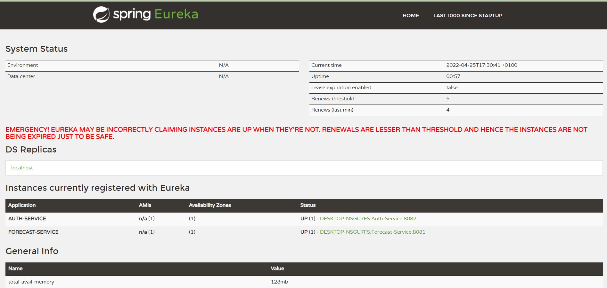

<div id="top"></div>

<!-- PROJECT LOGO -->
<br />
<div align="center">

<h3 align="center">Microservices Architecture</h3>

  <p align="center">
     Creating and communicating two microservices ( auth and forecast).
    <br />
  </p>
</div>


<!-- TABLE OF CONTENTS -->
<details>
  <summary>Table of Contents</summary>
  <ol>
    <li>
      <a href="#about-the-project">About The Project</a>
      <ul>
        <li><a href="#built-with">Built With</a></li>
      </ul>
    </li>
    <li>
      <a href="#getting-started">Getting Started</a>
      <ul>
        <li><a href="#prerequisites">Prerequisites</a></li>
        <li><a href="#installation">Installation</a></li>
      </ul>
    </li>
    <li><a href="#usage">Usage</a></li>
  </ol>
</details>


<!-- ABOUT THE PROJECT -->
## About The Project

This project illustrates the communication between different microservices. We have the forecast microservice that communicates with auth microservice which assure the the user is well connected via static data.
The forecast app will simply return data (a CSV File) when the user is connected or redirect to the auth microservice in case of failure.
I used the **Registry** app to expose and easily reference the difference microservices using the **Eureka Server and client**.

<p align="right">(<a href="#top">back to top</a>)</p>


### Built With

* [Spring-Boot](https://spring.io/projects/spring-boot)
* [thymeleaf](https://www.thymeleaf.org/)

<p align="right">(<a href="#top">back to top</a>)</p>


<!-- GETTING STARTED -->
## Getting Started

To get a local copy up and running follow these simple example steps.

### Prerequisites

Make sure you have a suited Java IDE.
* [intellj idea](https://www.jetbrains.com/fr-fr/idea/)
* [eclipse](https://www.eclipse.org/downloads/)
### Installation

1. Clone the repo
   ```sh
   git clone https://github.com/hamza-mahjoub/TP3-Microservices-Architecture.git
   ```

2. resolve your **pom.xml** dependencies.

<p align="right">(<a href="#top">back to top</a>)</p>


<!-- USAGE EXAMPLES -->
## Usage

**Eureka Server** home page:


<p align="right">(<a href="#top">back to top</a>)</p>
